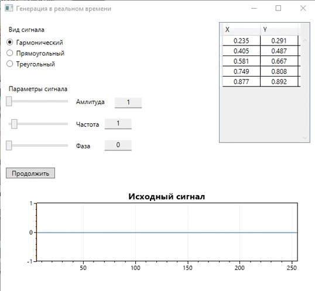
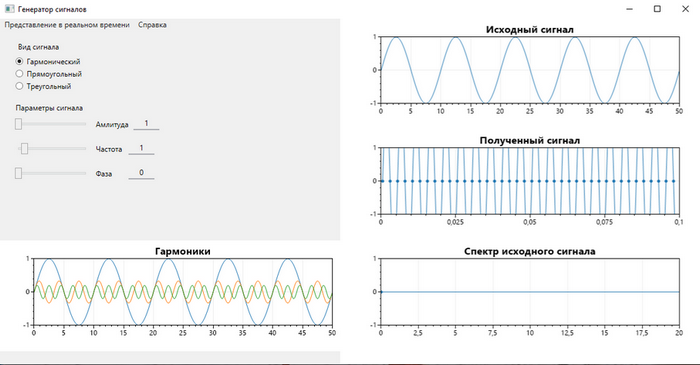
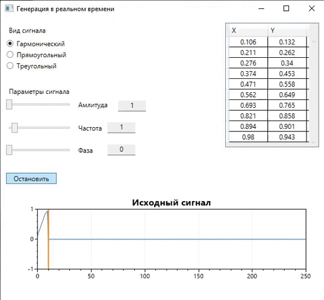

# Генератор сигналов

 

## О проекте 
Генератор сигналов позволяет генерировать сигнал различной формы с заданной частотой, амплитудой и фазой.
На главном экране отображаются графики исходного сигнала, гармоник, полученного сигнала и спектра исходного сигнала (с двумя последними есть проблемы). 
Используя переключатели и слайдеры вы можете настроить форму сигнала, графики обновятся сразу же после внесения изменений.

 

## Возможности
Несколько вещей, которые вы можете сделать в генераторе сигналов:
-   Выбрать форму генерируемого сигнала (гармоническая, треугольная, прямоугольная)
-   Изменять параметры сигнала с помощью слайдеров или текстового поля рядом сними
-   Масштабировать, копировать и сохранять полученные графики
-   Просматривать построение графика в реальном времени
-   Изменять параметры графика в реальном времени

 

## Стек технологий
-   .NET Fraemwork 4.8 
-   WPF
-   C#
-   Библиотека [ScottPlot](https://scottplot.net/ "Перейти на сайт ScottPlot") версия 4.1.45

## Статус проекта
В будущем планируется доработка приложения: исправить отображение спектра сигнала, изменить/добавить график спектограммы, добавление возможности отображать графики звукового сигнала с микрофона.