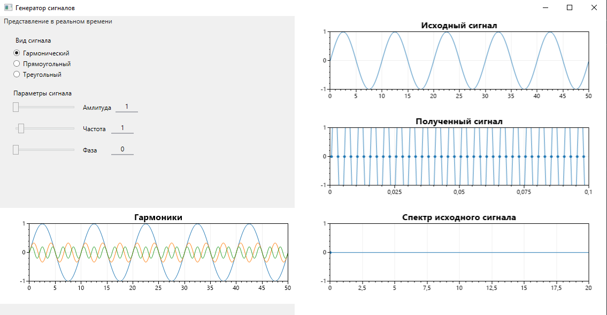

# Генератор сигналов

Генератор сигналов позволяет генерировать сигнал различной формы (гармонический, треугольный, прямоугольный) с заданной частотой, амплитудой и фазой. 

 

## 

На главном экране отображаются графики исходного сигнала, гармоник, полученного сигнала и спектра исходного сигнала (с двумя последними есть проблемы). 

 

 

 

 

В будущем планируется доработка приложения: исправить отображение спектра сигнала, изменить/добавить график спектограммы, добавление возможности отображать графики звукового сигнала с микрофона